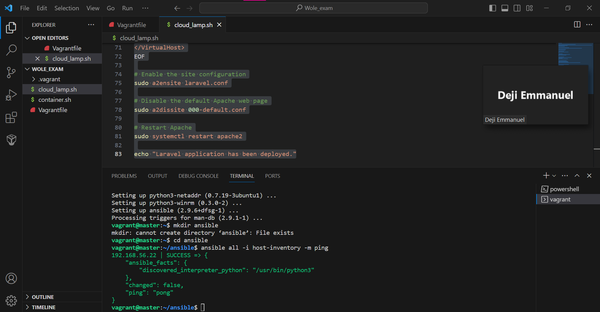
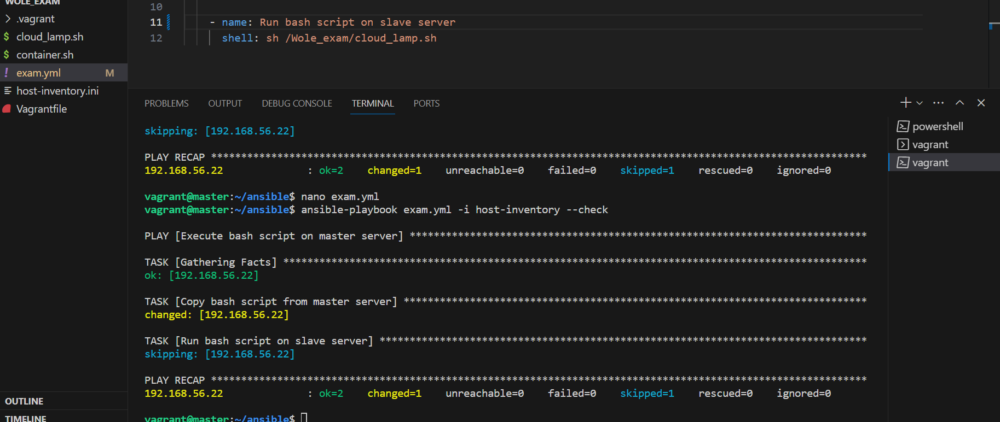
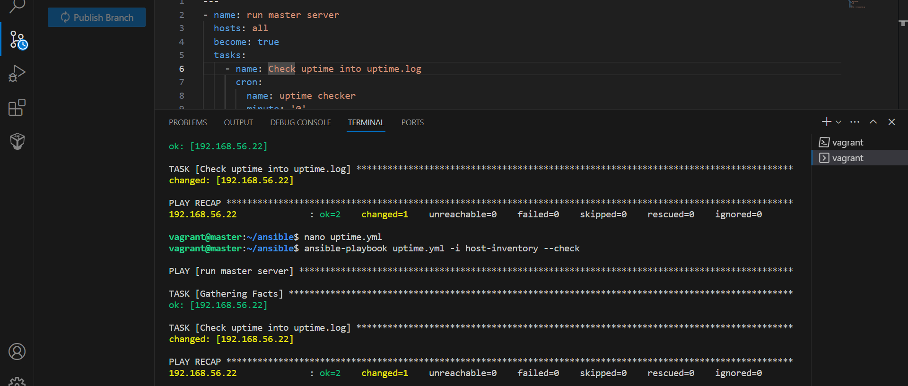
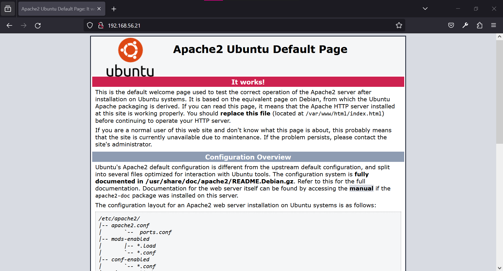

Deploying Laravel app on a Vagrant cluster

This project is completed for the Altschool  second semester examination project

Initializing the VM
The project uses a Master and Slave node. Whhere the master node contains the application's source code while the slave node is configured to manage the scripts and monitor server uptime

Installation
Clone the github repository into a folder Ensure Vagrant and Virtualbox is installed and running my device

In the terminal sh the provision file and run
This should initialise the VMs and clone the laravel app from <https://github.com/laravel/laravel.git>
The master node runs on 192.168.56.21
The slave node runs on 192.168.56.22

Slave setup
The slave is set up still using the same Provisioning file in the Container.sh and the ssh-key is configured into the file

Running Ansible playbooks
The slave node is cofigured to run 2 ansible playbooks, one to check server uptime and the other to run the cloud_lamp.sh

Monitoring server Uptime
In the slave node cd into etc/ansible

cd /etc/ansible ansible-playbook uptime.yml -i inventory
This should activate the cronjob for checking uptime every 12 hours. the output of the checks are recoreded in a file; uptime.log which can be found in the vagrant folder

